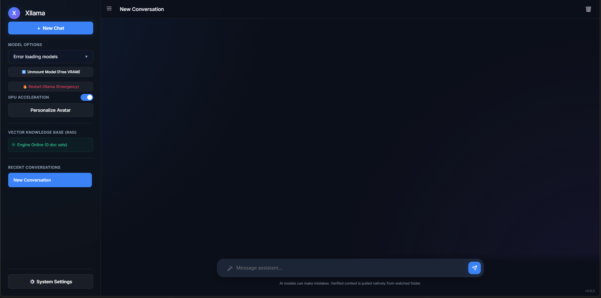

# Xllama
Better user interface for Ollama.

Contains better model organization, port forwarding, speech-to-text, and a bunch of other crap to run home models efficiently.
Made to be run locally on the same machine that is hosting your model, can then be pushed to your favorite network or VPN.

I'm too lazy to write how to use it, so you're just gonna have to figure it out.

